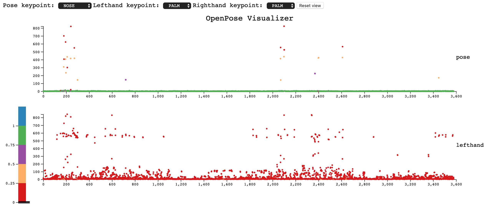
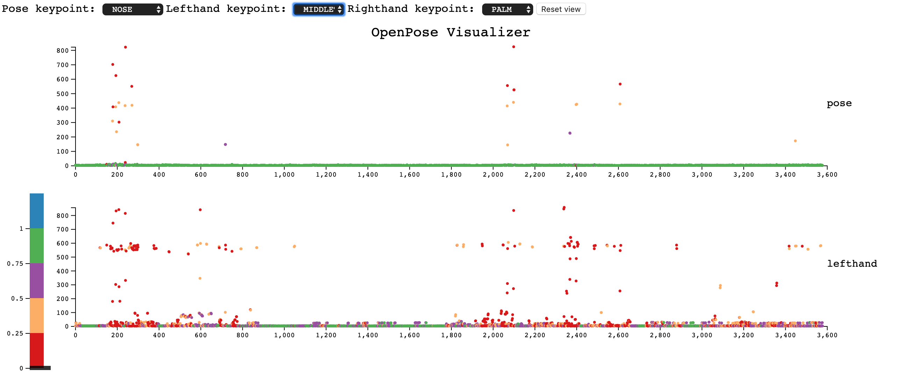
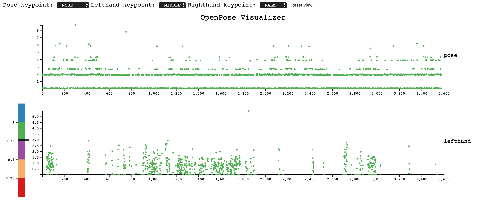
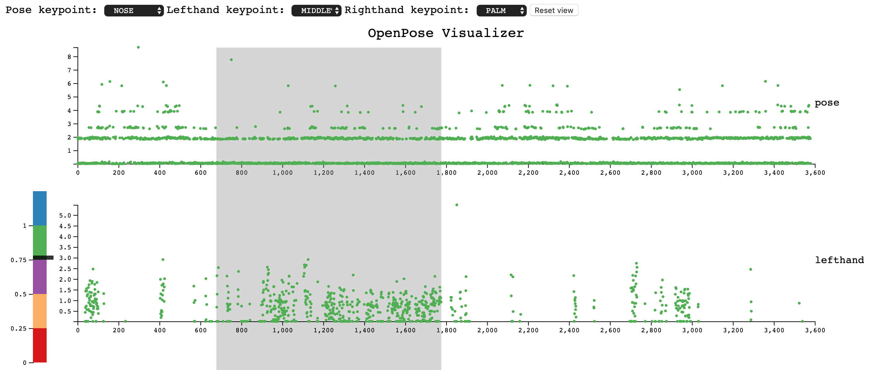
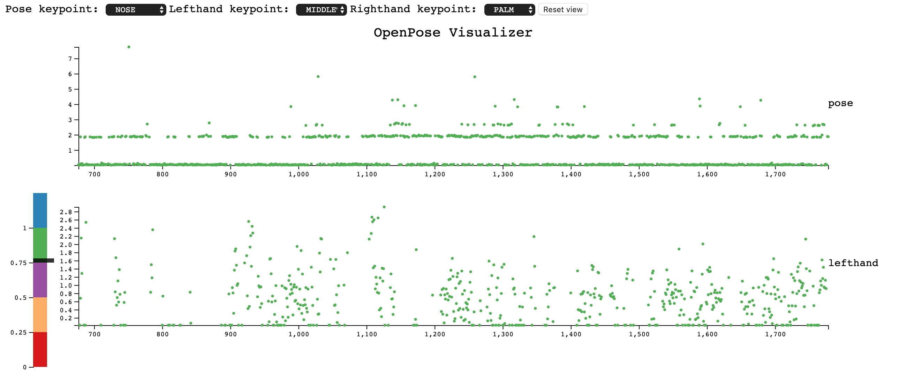
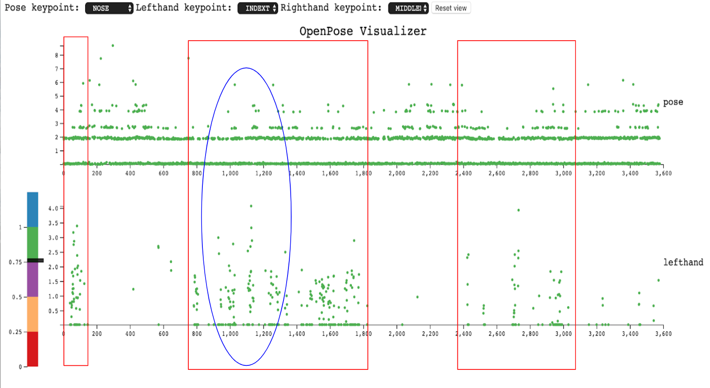

## OpenPose-Visualizer
> Vanderbilt *CS3891* *Introduction to Visualization* Final Project, fall 2019
> 
> I would like to thank Professor *Matthew Berger* and Professor *Benoit Dawant* for their help and guidance on this project
> 

#### Contents
- [Description](#description)
- [Overview](#overview)
- [Setup](#setup)
- [Process Book](#process-book)
    - [Motivation and Goals](#motivation-and-goals)
    - [Initial Data Analysis](#initial-data-analysis)
    - [Data Cleaning Process](#data-cleaning-process)
    - [Visualization Features](#visualization-features)
    - [Implementation Overview](#implementation-overview)
    - [Final Product](#final-product)
    - [Evaluations](#evaluations)
- [Summary](#summary)

### Description
The motivation of the *OpenPose Visualizer Project* is to build a visualization tool for constructing a proof-of-concept for designing an autonomous system that monitors the movements of epilepsy patients and uses machine learning algorithms to predict the onset of a potential epilepsy episode. We speculate that there are certain *movement patterns* that are likely to be indicators of a potential epilepsy episode and thus we should be able to train a neural network to recognize such patterns.
Using *OpenPose*, we are able to identify and record the positions of various keypoints on a human body. However, it is hard for us to analyse and evaluate the validity of these data. Therefore, the OpenPose Visualizer aims to represent these data in a way that is intuitive and effective to the human eyes, thus making it possible for us to get a better understanding of the data.

### Overview
The *OpenPose Visualizer* used **[d3.js](https://d3js.org/)** to visualize and interact with the data.
File [`Documents`](/Documents) includes the proposal, process book and other related document files of the project; [`Data`](/Data) includes the raw data as well as the processed data used in this project; [`Python`](/Python) includes the python script used for the processing; [`Source`](/Source) contains all of the project code. [`Images`](/Images) contains some of the sample images used in this document.

### Setup
To run the project, clone the project repository to your local machine and run `python -m SimpleHTTPServer` in the terminal in the root directory of the project. Then, go to the following url: [http://localhost:8000/](http://localhost:8000/) in your browser to see the project contents.

---

## Process Book

### Motivation and Goals
As mentioned above, the motivation of the *OpenPose Visualizer Project* is to build a visualization tool for constructing a proof-of-concept for designing an autonomous system that monitors the movements of epilepsy patients and uses machine learning algorithms to predict the onset of a potential epilepsy episode. We want the visualization to help us gain a better understanding of the following questions:
1. Are the data generated by *OpenPose* accurate enough to reconstruct the movement trace?
2. If so, are there any movement patterns distinct enough for the human eyes to recognize during an epilepsy episode?
3. If so, can we use these patterns as indicators of a potential epilepsy episode?

### Initial Data Analysis
A detail overview of the data generated by the *OpenPose* can be found [here](https://github.com/CMU-Perceptual-Computing-Lab/openpose/blob/master/doc/output.md). I wrote a few python scripts to calculate the Euclidean distance of the same keypoint position between every two consecutive frames for each keypoint in the original JSON file and combine the results into one single JSON file. Given the timeline and data validity (*OpenPose* did not recognize the patient’s face for most of the frames due to the quality of the video), the *OpenPose Visualizer* will only be using the data from [pose_keypoints_2d](/Data/EMU_Processed/pose_keypoints_2d.json), [hand_left_keypoints_2d](/Data/EMU_Processed/hand_left_keypoints_2d.json), and [hand_right_keypoints_2d](/Data/EMU_Processed/hand_right_keypoints_2d.json).

### Visualization Features
#### 11/05/2019
The basic layout of the visualization will be three *line charts* with *coordinated views*. The *y-axis* of each line chart will correspond to the *Euclidean distance* and the *x-axis* will correspond to the *frame number*. The user should be able to *zoom in and out* around a certain frame and *select* a group of keypoints to *highlight*. Furthermore, if possible, the user should be able to add more plots by clicking the *Add* button and choosing a specific keypoint. 

#### 11/10/2019
The *add-a-plot* feature was canceled at this time unfortunately due to the timeline of the project. I also decided to use scatter plots instead of line plots since the data are discrete. However, I decided to add a *filter bar* to the visualization since the initial visualization did not look good due to the fact that a few outlier data points stretched out the scale and make the rest of the data points really hard to see. The newly added filter bar has a *draggable* line that represents a *threshold* confidence value. Only data points whose overall confidence value is above this threshold will be plotted. The plots will be *updated and rescaled* after the user updates the threshold confidence value.

#### 11/18/2019
Since the visualization uses dropdown menus for the selection of the keypoints, a drawback with this approach is that the user does not know which keypoint to select at first. *Dr. Bergers* suggested to visually communicate the distribution of each keypoint, rather than a single number, e.g. mean and variance, where the latter would seem important for understanding what body parts are rapidly changing. However, the problem with this method is that even if the variance of a keypoint is high, it could still have *two* possibilities: 1. The position of the keypoint was changing rapidly; 2. *OpenPose* did not know what it was doing and generated a lot of garbage values with low confidence. Since the user would not want to look at keypoints with low accuracy, I thought it would be better to encode the overall confidence level of each keypoint. Although I did not come up with a way to effectively communicate this to the user before the selection (mostly because there are *over 60 keypoints* and it is hard to fit them all in a single web page), I did manage to *color-code* each data point based on its own confidence value using a diverging color scale. Therefore, after choosing a keypoint, the user will at least be able to decide if it contains valuable information for a more detailed look.

### Implementation Overview
#### 11/10/2019
Finished the basic layout structure of the visualiztion. Added the pose plot. Continuing working on the dropdown menus and the filter bar. Right now everything is hard coded and I can see that this will result in a lot of redundant and ugly code in the future so that needs to be fixed soon.

#### 11/14/2019
Finished implementing the *filter bar* and the *dropdown menus*. Added *coordinated views* so that whenever the user selects a new threshold confidence level, all three plots will be updated and rescaled accordingly. Rewrote most of the code responsible for rendering the plots to make it reusable and robust enough to support potential addition of visualization features. Added some css for the texts and the dropdown menus.

#### 11/18/2019
Finished implementing the *brush-and-zoom* and *color-coded* each data point based on its overall confidence level. Added *reset view* button that zooms out the plots to its original view while *retaining* the threshold confidence level. Added *color legends* and *axis* for the filter bar. Added *labels* to each plot.

### Final product
#### Effective use of visual channels:
##### 1. Color
Using a threshold scale, data points with different range of overall confidence level will be colored accordingly. Furthermore, since the threshold was implemented with a diverging color range, data points with low confidence level will be easily distinguished from those with high confidence level. Therefore, at a first glance, the user will receive constructive visual feedbacks on the validity of the data of the keypoint selected.
##### 2. Spatial position
By mapping each data point to a specific position on a 2D plane, the user will be able to see the relationship between the movement trace and the frame number, making the process of observing potential patterns more straightforward. Furthermore, it also makes it easier for the user to observe the range of the data points, i.e. the maximum and minimum value over a specific amount of frames.
##### 3. Interaction
###### a. Drag and filter
By dragging the threshold line, the user can easily filter out data whose confidence level is below the selected threshold value. This will allow the visualization to become more effective since it will eliminate outliers that stretch out the scale and reconstruct a more accurate representation of the remaining data points.
###### b. Brush and zoom
Since there are about 3600 frames, it is hard to see a specific area of the distribution of the data points. Therefore, having a way to interactively modify the view is necessary to obtain a more detailed information on the data. By brushing along the x-axis, the user will be able to zoom in on the plot around the selected frames and the plot will be rescaled accordingly.
###### c. Multiple and coordinated views
By having a coordinated view between the three plots, it is easier for the user to observe the relationship between different body parts.

### Evaluations
#### 1. Visual feedback
When the user selects palm as the keypoint for the lefthand plot, the majority of the data points are red, meaning that they are low in confidence level. Therefore the user knows to select a different keypoint to plot.
.
#### 2. Diverging color scale
Data points with high confidence levels have a very different hue than those with low confidence levels. Therefore the user can easily distinguish between them. As seen below, when the user chooses the tip of the middle finger as the keypoint for the lefthand plot, there are more points with higher confidence levels. 
.
#### 3. Filter data
By dragging the threshold line, the user will be able to filter out data points whose confidence level is below the threshold line and have a better view of the remaining points as the plots rescale.
.
#### 4. Brush and zoom
The user can brush along the x-axis to restrict the view around a certain number of frames to get a more detailed view

Below is the area where the epilepsy occured in the video. As seen in the visualization, the pose plot displays a rather stable movement of the keypoint (keypoint bounces between 0 and 2 for most of the frames which means it was barely moving). Whereas the distribution of the lefthand keypoint is rather chaotic. This could result from the fact that when the patient was having the epilepsy episode, his hands were twitching but the rest of his body was still.  
.
#### 5. Pattern

Zooming out the plots back to their original views, we can see that there are three areas that contain such pattern. If we can see such pattern occurring on other epilepsy patients, we should be able to train a neural network to recognize it.
.
---

